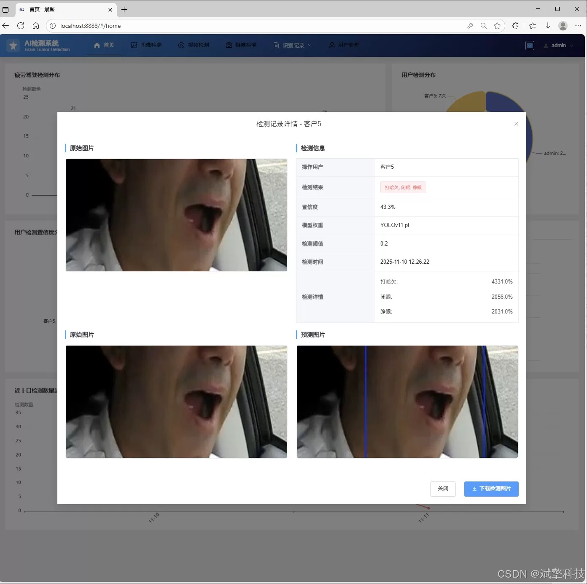
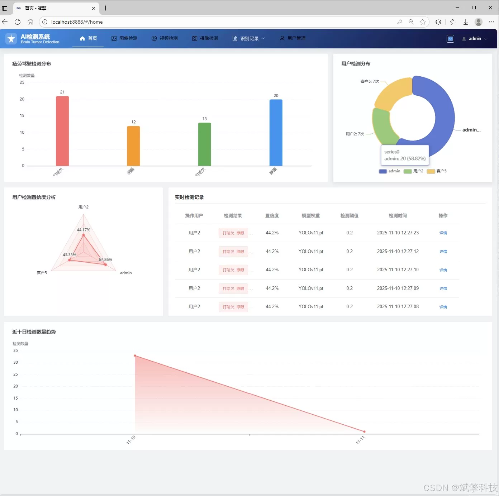
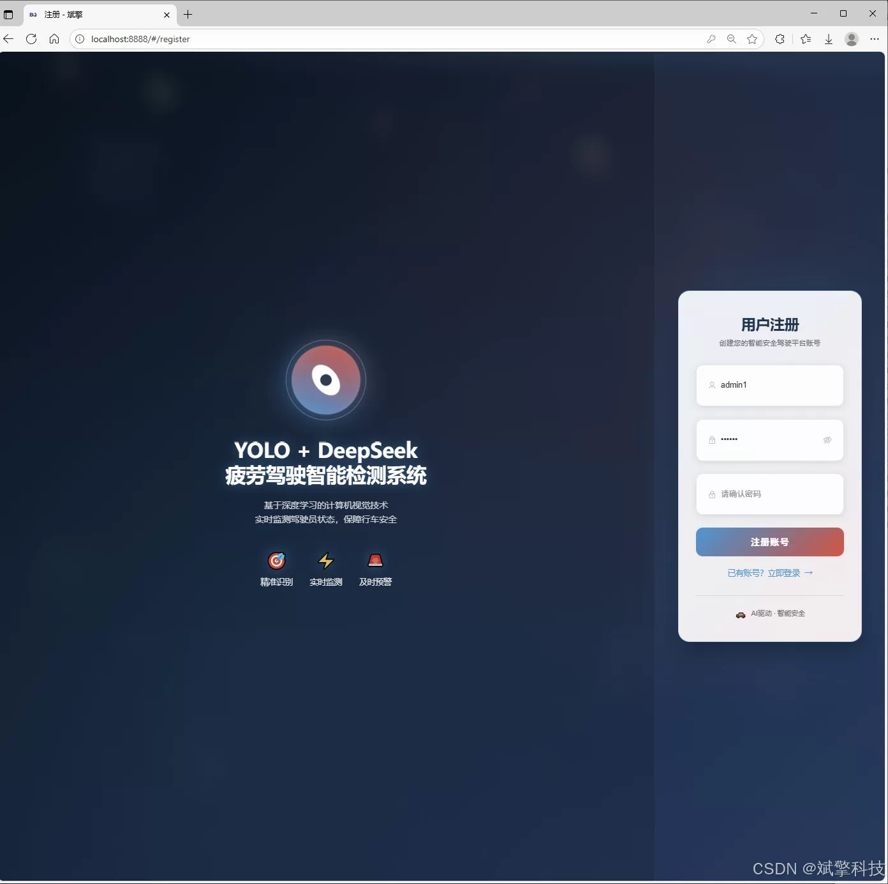
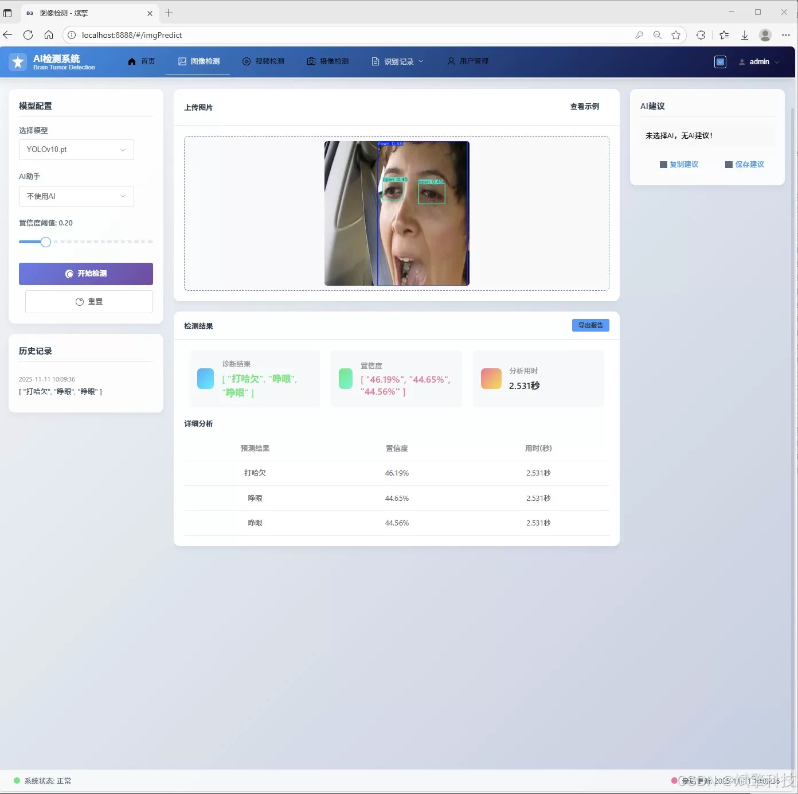
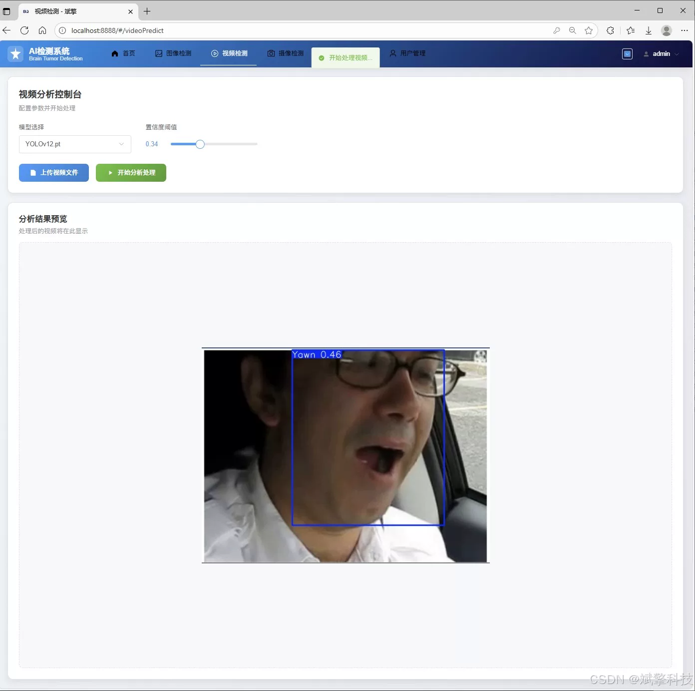
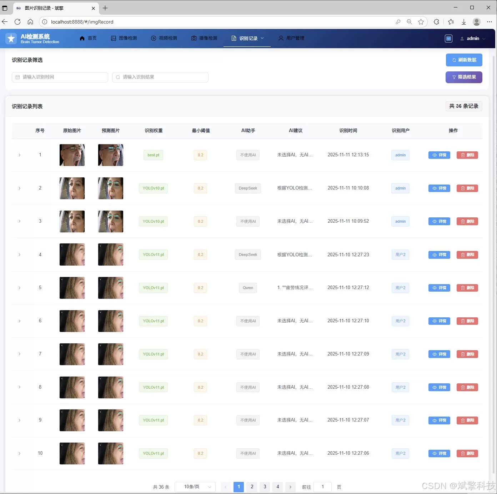
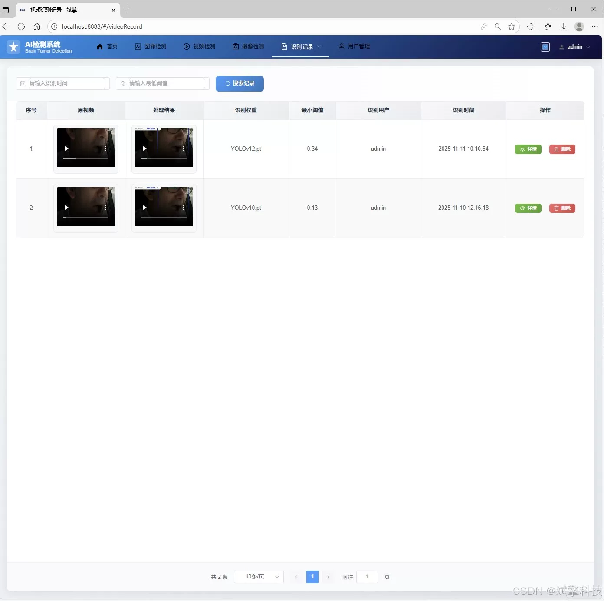
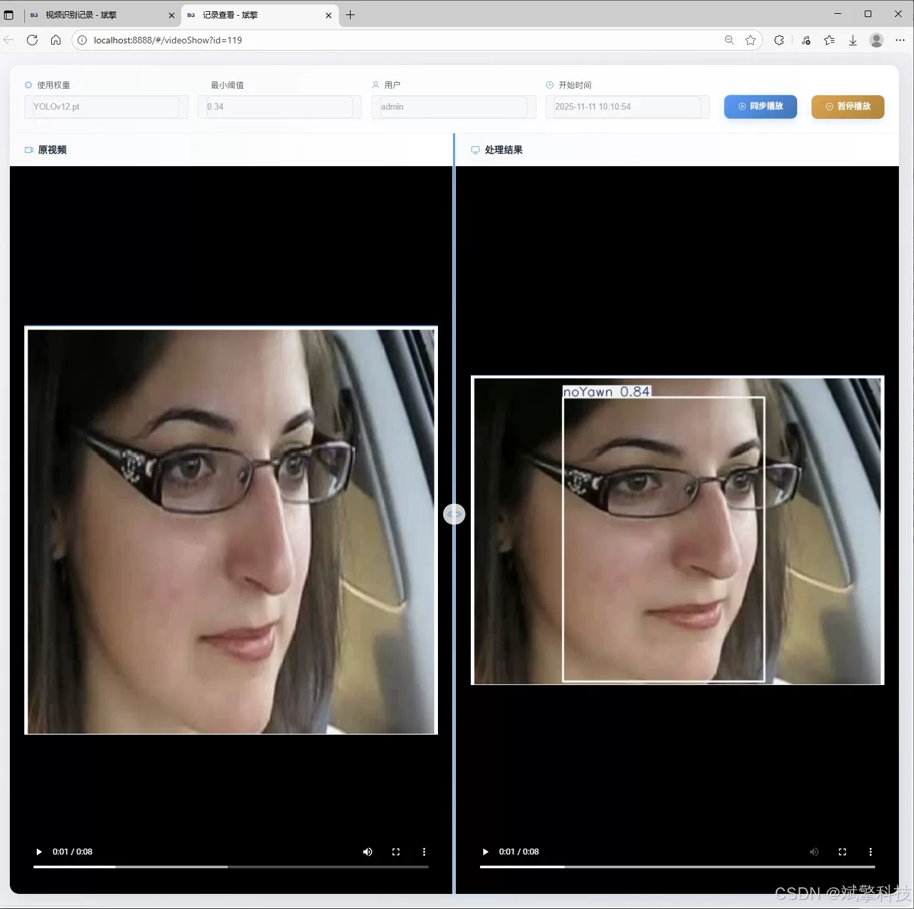
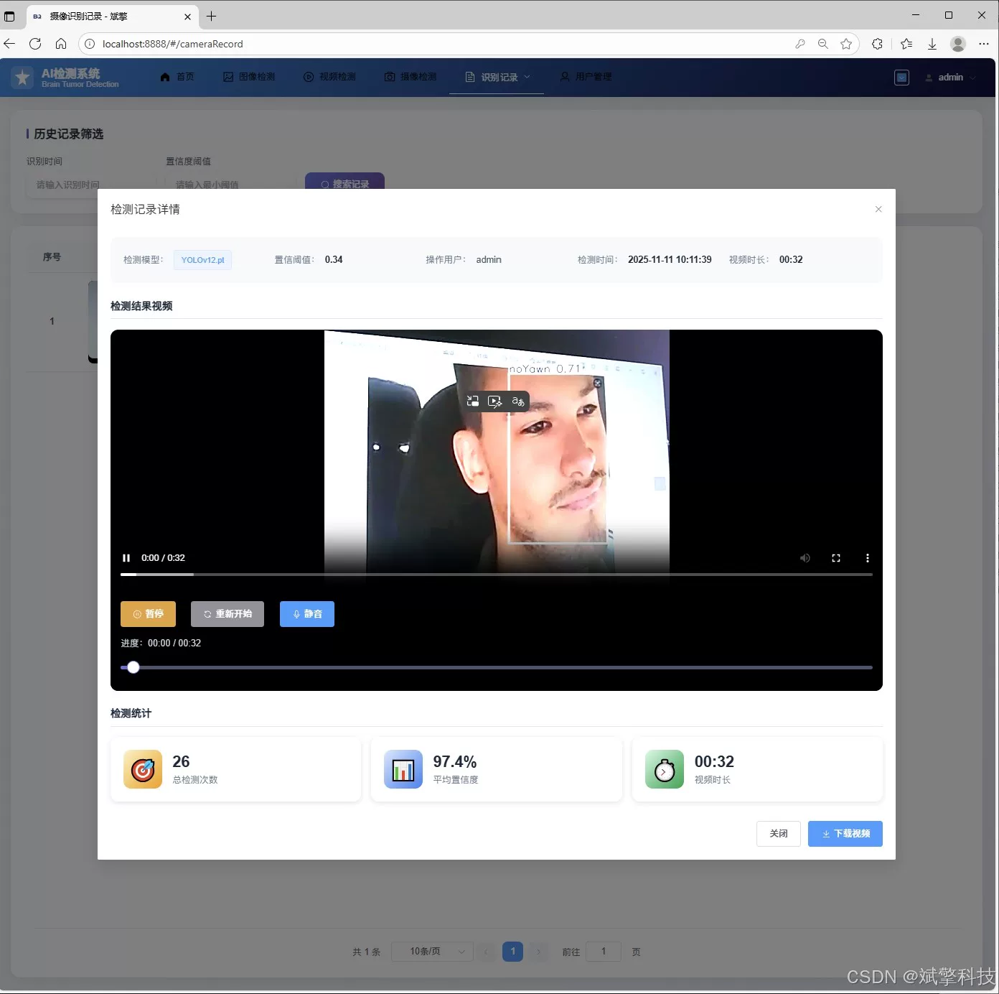

# YOLO+Large Model Fatigue Driving Detection System

## Body

The YOLO+Large Model Fatigue Driving Detection System is based on the YOLO deep learning and the large models of Qianwen and DeepSeek. The system (DeepSeek intelligent analysis + web interface + front-end and back-end separation + YOLO data + YOLOv8/YOLOv10/YOLOv11/YOLOv12) can detect fatigue driving.

Currently, artificial intelligence technology is profoundly changing various industries, especially in intelligent analysis and early warning systems of security and transportation. The YOLO (You Only Look Once) series algorithms, as benchmarks for single-stage target detection, are very fast and have high accuracy, which are very suitable for real-time requirements in driving scenes. From YOLOv8 to the latest proposed YOLOv12, the model has been continuously optimized in backbone network, neck structure, loss function and training strategy, providing diversified and powerful model choices for our fatigue detection task.

At the same time, the development of software architecture has also provided convenience for the implementation of such systems. SpringBoot, as the most popular backend framework in the Java field, is known for its simplified configuration, rapid development, and strong ecosystem, which can robustly build system backend services. The front-end separation architecture pattern enables the front-end interface (such as Vue.js, React) to be completely decoupled from the back-end business logic, not only improving the efficiency of development but also ensuring the maintainability and scalability of the system.

This system integrates cutting-edge deep learning models with mature web development technologies to create a comprehensive platform that encompasses model inference, data management, user interaction, and intelligent analysis. The system not only achieves core detection functions but also provides a complete user management and data visualization module, aiming to provide a practical solution prototype for fleet management, driving school training, and even future integration into smart cockpit systems.

Functional module

✅ Information Visualization, Data Visualization.

✅ Image detection supports AI analysis functions, deepseek and Qianwen.

✅ Supports image detection, video detection, and real-time camera detection. The results are saved to a MySQL database.

✅ Picture recognition record management, video recognition record management and camera recognition record management.

✅ User Management Module, administrators can add, delete, modify, and query users.

✅ Personal center, can modify their own information, password name profile picture and so on.

There is no Lunwen writing service, nor any Lunwen.

## Images

## Payment

Here is a pay link on Stripe ( https://buy.stripe.com/3cs8yP7sY87d0vu9AB ). Please contact me lonlonago@foxmail.com after funding $89, and I will send you a complete data files , thank you!

